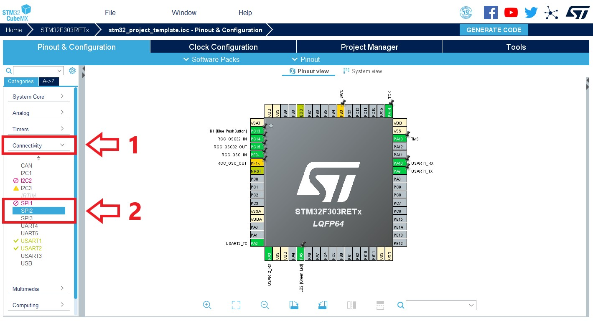
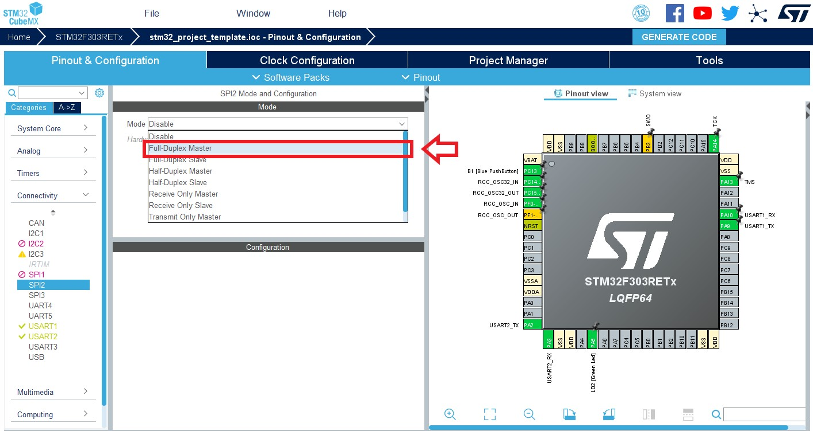
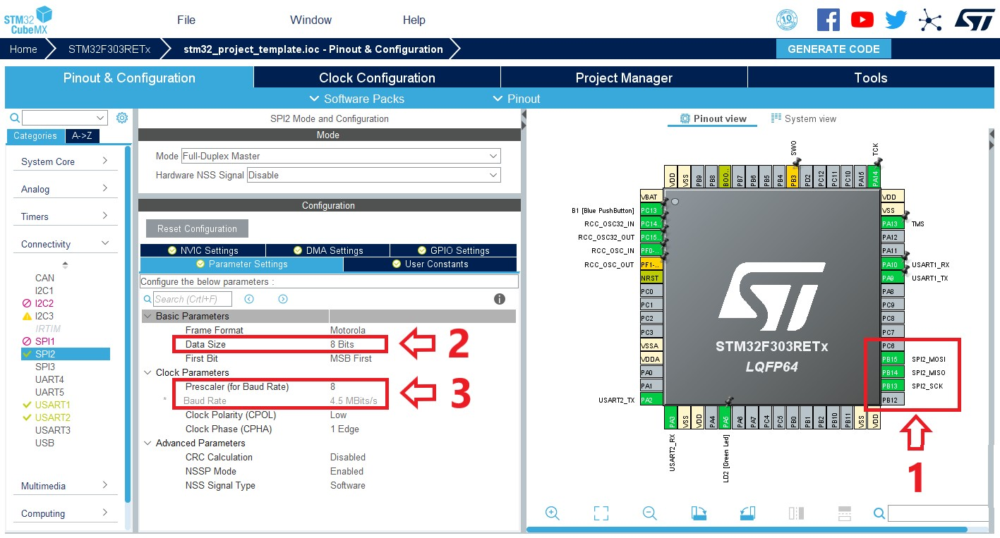
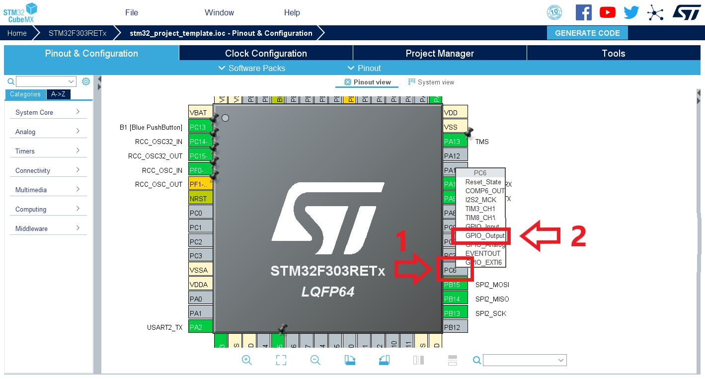
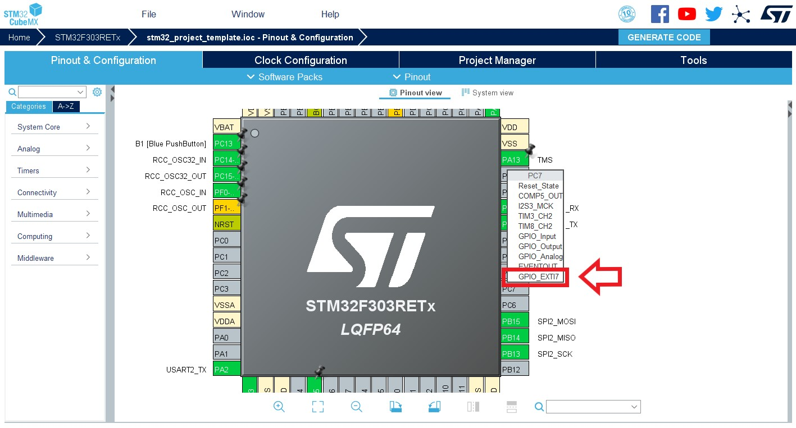
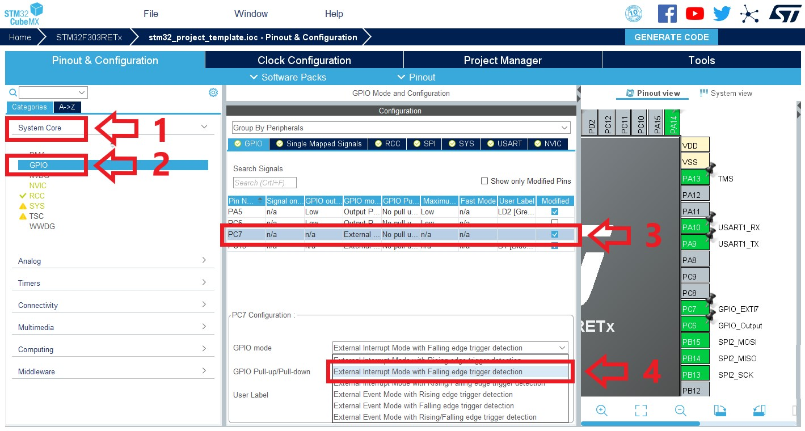

[](https://forthebadge.com)
[](https://forthebadge.com)

<!-- ALL-CONTRIBUTORS-BADGE:START - Do not remove or modify this section -->
[](#contributors-)
<!-- ALL-CONTRIBUTORS-BADGE:END -->


# 📡 STM32RF24

## 📜 Índice

- [🎉 Introdução](#-introdução)
- [➕ Requisitos](#-requisitos)
- [📦 Submódulos com Git](#-submódulos-com-git)
    - [💥 Adicionando um submódulo](#-adicionando-um-submódulo)
    - [✅ Inicializando um submódulo já existente](#-inicializando-um-submódulo-já-existente)
- [📁 Estrutura do Repositório](#-estrutura-do-repositório)
- [📝 Documentação](#-documentação)
- [🏗️ Estrutura do Código](#-estrutura-do-código)
- [🔌 Configuração de Hardware](#-configuração-de-hardware)
  - [🤔 Conhecendo o módulo](#-conhecendo-o-módulo)
  - [🔧 Configurando o microcontrolador](#-configurando-o-microcontrolador)
- [📚 Usando a biblioteca](#-usando-a-biblioteca)
- [📝 Contribuindo](#-contribuindo)
- [✨ Contribuidores](#-contribuidores)

## 🎉 Introdução

Esse repositório contém uma biblioteca para lidar com o módulo de rádiofrequência nRF24L01 da Nordic Semiconductor, cujo datasheet pode ser visto [aqui](docs/Nordic_Semiconductor-NRF24L01-datasheet.pdf).

Essa biblioteca foi feita para ser utilizada como submódulo no [STM32ProjectTemplate](https://github.com/ThundeRatz/STM32ProjectTemplate).


## ➕ Requisitos

Essa biblioteca não requer, para funcionar, nenhum requisito extra, além dos já listados [requisitos do STM32ProjectTemplate](https://github.com/ThundeRatz/STM32ProjectTemplate#requisitos).

Porém, caso se deseje gerar a documentação, como descrito na seção [📝 Documentação](#-documentação), é necessário instalar o Doxygen. No Ubuntu é possível instalá-lo com o seguinte comando:

```bash
sudo apt install doxygen
```

Para outros sistemas operacionais é possível ver opções de download na [página oficial do Doxygen](https://www.doxygen.nl/download.html).


## 📦 Submódulos com Git

Como dito, essa biblioteca funciona como um submódulo. Dessa forma se facilita escolher a versão da biblioteca que será utilizada no projeto, permitindo também o desenvolvimento em paralelo da biblioteca.

### 💥 Adicionando um submódulo

Crie um diretório chamado `lib`, caso não exista:

```bash
mkdir lib
```

E adicione o submódulo fazendo:

* Com HTTPS:
```bash
git submodule add --name STM32RF24 https://github.com/ThundeRatz/STM32RF24.git lib/STM32RF24
```

* Com SSH:
```bash
git submodule add --name STM32RF24 git@github.com:ThundeRatz/STM32RF24.git lib/STM32RF24
```

### ✅ Inicializando um submódulo já existente

Ao clonar um repositório que já tenha submódulos, é necessário clonar os repositórios desse submódulo. Isso pode ser feito de duas formas, clonando junto com o repositório do projeto ou depois de já ter clonado.

Exemplo:

Para se clonar junto, rode o seguinte comando, trocando para o link do repositório do seu projeto:

```bash
git clone --recurse-submodules git@github.com:ThundeRatz/STM32ProjectTemplate.git
```

Para se clonar depois de já ter clonado o repositório do projeto, dentro dele, deve-se fazer:

```bash
git submodule update --init
```


## 📁 Estrutura do Repositório

O repositório contém as seguintes pastas:

- **docs/** → Arquivos de documentação
- **inc/** → Arquivos de cabeçalho
- **src/** → Arquivos de código fonte

Na raiz do repositório, além dos arquivos que contém o código de conduta, diretrizes de contribuição, README e licensa, há o arquivo `sources.mk`, que é responsável por possibilitar com que os arquivos da biblioteca sejam encontrados quando se compila o código. Também há um `Doxyfile` para gerar a documentação.


## 📝 Documentação

Essa biblioteca é documentada usando Doxygen. Para gera a documentação, rode o seguinte comando estando na raiz do seu repositório:

```bash
doxygen
```

As configurações estão no arquivo [Doxyfile](./Doxyfile).


## 🏗️ Estrutura do Código

O código está estruturado da seguinte forma:

- `nrf24l01_registers.h` → tipos e constantes relacionados aos registradores do módulo.
- `rf24_platform.c/.h` → tipos e funções de mais baixo nível que utilizam o HAL.
- `rf24.c/.h` → tipos e funções de mais alto nível para utilização do usuário.
- `rf24_debug.c/.h` → funções úteis para se validar o funcionamento do módulo.


## 🔌 Configuração de Hardware

### 🤔 Conhecendo o módulo

Para se fazer a configuração do seu hardware, é necessário primeiramente se analisar a pinagem do módulo nRF24L01, como pode ser vista abaixo:


O módulo utiliza SPI (Serial Protocol Interface) para se comunicar com o microcontrolador (para saber mais sobre SPI, recomendo esse artigo [aqui](https://learn.sparkfun.com/tutorials/serial-peripheral-interface-spi/all) da Sparkfun), dessa forma são necessários quatro pinos para essa comunicação, o SCK, o MISO, o MOSI e o CSN. O CSN é um pino de GPIO, enquanto os outros são pinos dedicados.

Além disso, é necessário um pino de GPIO conectado ao CE (Chip Enable), que é utilizado para se fazer o controle do módulo, possibilitando a trasição entre os estados da máquina de estados do módulo.

O módulo também conta com um pino IRQ (Interruption Request), possibilitando o funcionamento do módulo por meio de interrupções, esse pino deve ser conectado em um pino que suporte interrupções no microcontrolador caso se queira fazer uso desse recurso, caso contrário, deve-se ligá-lo ao 3,3V, uma vez que o pino é ativo baixo.

### 🔧 Configurando o microcontrolador














## 📚 Usando a biblioteca


## 📝 Contribuindo

Toda a ajuda no desenvolvimento da robótica é bem-vinda, nós lhe encorajamos a contribuir para o projeto! Para saber como fazer, veja as diretrizes de contribuição [aqui](CONTRIBUTING.pt-br.md).

## ✨ Contribuidores

Agradecimento a essas pessoas maravilhosas ([emoji key](https://allcontributors.org/docs/en/emoji-key)):

<!-- ALL-CONTRIBUTORS-LIST:START - Do not remove or modify this section -->
<!-- prettier-ignore-start -->
<!-- markdownlint-disable -->
<table>
  <tr>
    <td align="center"><a href="https://github.com/LucasHaug"><br /><sub><b>Lucas Haug</b></sub></a><br /><a href="https://github.com/ThundeRatz/STM32RF24/commits?author=LucasHaug" title="Code">💻</a> <a href="https://github.com/ThundeRatz/STM32RF24/commits?author=LucasHaug" title="Documentation">📖</a> <a href="https://github.com/ThundeRatz/STM32RF24/commits?author=LucasHaug" title="Tests">⚠️</a> <a href="#translation-LucasHaug" title="Translation">🌍</a></td>
    <td align="center"><a href="https://github.com/lucastrschneider"><br /><sub><b>Lucas Schneider</b></sub></a><br /><a href="https://github.com/ThundeRatz/STM32RF24/commits?author=lucastrschneider" title="Code">💻</a> <a href="https://github.com/ThundeRatz/STM32RF24/commits?author=lucastrschneider" title="Documentation">📖</a> <a href="https://github.com/ThundeRatz/STM32RF24/commits?author=lucastrschneider" title="Tests">⚠️</a> <a href="#translation-lucastrschneider" title="Translation">🌍</a></td>
    <td align="center"><a href="https://github.com/d-nery"><br /><sub><b>Daniel Nery</b></sub></a><br /><a href="https://github.com/ThundeRatz/STM32RF24/commits?author=d-nery" title="Code">💻</a></td>
    <td align="center"><a href="https://github.com/FelipeGdM"><br /><sub><b>Felipe Gomes de Melo</b></sub></a><br /><a href="#ideas-FelipeGdM" title="Ideas, Planning, & Feedback">🤔</a></td>
    <td align="center"><a href="https://github.com/Berbardo"><br /><sub><b>Bernardo Coutinho</b></sub></a><br /><a href="https://github.com/ThundeRatz/STM32RF24/commits?author=Berbardo" title="Tests">⚠️</a></td>
  </tr>
</table>

<!-- markdownlint-restore -->
<!-- prettier-ignore-end -->

<!-- ALL-CONTRIBUTORS-LIST:END -->

Esse projeto segue as especificações do [all-contributors](https://github.com/all-contributors/all-contributors). Contribuições de qualquer tipo são bem-vindas!

---------------------

Equipe ThundeRatz de Robótica
