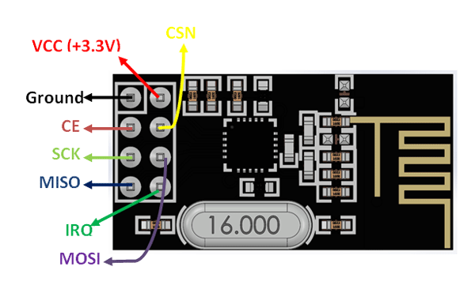

[](https://forthebadge.com)
[](https://forthebadge.com)

<!-- ALL-CONTRIBUTORS-BADGE:START - Do not remove or modify this section -->
[](#contributors-)
<!-- ALL-CONTRIBUTORS-BADGE:END -->


# 📡 STM32RF24

Para a versão em PT-BR 🇧🇷 desse documento, [veja aqui](./README.pt-br.md).

## 📜 Index

- [🎉 Intro](#-intro)
- [➕ Requirements](#-requirements)
- [📦 Git Submodules](#-git-submodules)
  - [💥 Adding a submodule](#-adding-a-submodule)
  - [✅ Initializing an existing submodule](#-initializing-a-existing-submodule)
- [📁 Repository Structure](#-repository-structure)
- [📝 Documentation](#-documentation)
- [🎨 Formatting](#-formatting)
- [🏗️ Code Structure](#-code-structure)
- [🔌 Hardware Configuration](#-hardware-configuration)
  - [🤔 Getting to know the module](#-getting-to-know-the-module)
  - [🔧 Configuring the microcontroller](#-configuring-the-microcontroller)
- [📚 Using the library](#-using-the-library)
  - [🏁 Initializing](#-initializing)
  - [📤 Using as a transmitter](#-using-as-a-transmitter)
  - [📩 Using as a receiver](#-using-as-a-receiver)
  - [🐛 Debugging](#-debugging)
- [👥 Contributing](#-contributing)
- [✨ Contributors](#-contributors)

## 🎉 Intro

This repository contains a library to handle Nordic Semiconductor's radio frequency module nRF24L01, whose datasheet can be viewed [here](docs/Nordic_Semiconductor-NRF24L01-datasheet.pdf), when using the microcontrollers of the [STM32](https://www.st.com/en/microcontrollers-microprocessors/stm32-32-bit-arm-cortex-mcus.html) family.

This library was made to be used as a submodule in the [STM32ProjectTemplate](https://github.com/ThundeRatz/STM32ProjectTemplate).


## ➕ Requirements

This library does not require any extra requirements to function, in addition to those already listed [STM32ProjectTemplate requirements](https://github.com/ThundeRatz/STM32ProjectTemplate#requisitos).

However, if you want to generate the documentation, as described in the section [📝 Documentation](#-documentation), it is necessary to install Doxygen. In Ubuntu, it is possible to install it with the following command:

```bash
sudo apt install doxygen
```

For other operating systems, you can see download options on the [official Doxygen page](https://www.doxygen.nl/download.html).

Besides that, for formatting `uncrustify` is used, as described in the section [🎨 Formatting](#-formatting). To install it, on Ubuntu, run the following command on the terminal:

```bash
sudo apt install uncrustify
```

On Windows, download the `.zip` from [SourceForge](https://sourceforge.net/projects/uncrustify/files/). Add the location of the executable in the `PATH` environment variable.


## 📦 Git Submodules

As stated, this library functions as a submodule. In this way, it is easier to choose the version of the library that will be used in the project, also allowing its development in parallel.

### 💥 Adding a submodule

Create a directory called `lib`, if it does not exist:

```bash
mkdir lib
```

And add the submodule by doing:

* With HTTPS:
```bash
git submodule add --name STM32RF24 https://github.com/ThundeRatz/STM32RF24.git lib/STM32RF24
```

* With SSH:
```bash
git submodule add --name STM32RF24 git@github.com:ThundeRatz/STM32RF24.git lib/STM32RF24
```

### ✅ Initializing an existing submodule

When cloning a repository that already has submodules, it is necessary to clone the repositories of that submodule. This can be done in two ways, by cloning together with the project repository or after you have already cloned.

Example:

To clone together, run the following command, switching to the repository link of your project:

```bash
git clone --recurse-submodules git@github.com:ThundeRatz/STM32ProjectTemplate.git
```

To clone having already cloned the project repository, within it, you should do:

```bash
git submodule update --init
```

## 📁 Repository Structure

The repository contains the following folders:

- **assets/** → Images and `.css` files for documentation
- **docs/** → Documentation files
- **inc/** → Header files
- **src/** → Source files

At the root of the repository, in addition to the files containing the code of conduct, contribution guidelines, README and license, there is the `sources.mk` file, which is responsible for making it possible for the library files to be found when compiling the code. There is also a `Doxyfile` to generate the documentation. Another relevant file is `uncrustify.cfg` which is used to format the files.

## 📝 Documentation

This library is documented using Doxygen. To generate the documentation, run the following command at the root of your repository:

```bash
doxygen
```

The settings are in the file [Doxyfile](./Doxyfile).

## 🎨 Formatting

Besides good documentation, it is necessary that the code is always well formatted, which facilitates its understanding. For that, `uncrustify` was used. With `uncrustify` installed, to format a file that has changed, run the following command:

```bash
uncrustify -c uncrustify.cfg --replace --no-backup path_to_file/file_name
```

## 🏗️ Code Structure

The code is structured as follows:

- `nrf24l01_registers.h` → types and constants related to the module registers.
- `rf24_platform.c/.h` → lower-level types and functions that use HAL.
- `rf24.c/.h` → highest level types and functions for user use.
- `rf24_debug.c/.h` → useful functions to validate the module's operation.

## 🔌 Hardware Configuration

### 🤔 Getting to know the module

To configure your hardware, you must first analyze the pinout of the nRF24L01 module, as shown below:



The module uses SPI (Serial Protocol Interface) to communicate with the microcontroller (to learn more about SPI, we recommend this article [here](https://learn.sparkfun.com/tutorials/serial-peripheral-interface-spi/all) from Sparkfun), so four pins are required for this communication, SCK, MISO, MOSI and CSN. The CSN is a GPIO pin, while the others are dedicated pins.

In addition, a GPIO pin connected to the CE (Chip Enable) is needed, which is used to control the module, enabling the transition between the states of the module's finite state machine.

The module also has an IRQ (Interruption Request) pin, allowing the module to function through interruptions. This pin must be connected to a pin that supports interruptions in the microcontroller if you want to use this feature, otherwise, you must connect it to the 3.3V, since the pin is active low.

### 🔧 Configuring the microcontroller

To configure the microcontroller, the [STM32CubeMX](https://www.st.com/en/development-tools/stm32cubemx.html), one of the requirements of the [STM32ProjectTemplate](https://github.com/ThundeRatz/STM32ProjectTemplate), will be used. Besides that, it will be necessary to have a project configured in Cube, if you don't have it, see the [STM32ProjectTemplate README](https://github.com/ThundeRatz/STM32ProjectTemplate#stm32-project-template) and for more details see the [STM32Guide](https://github.com/ThundeRatz/STM32Guide).

With the project open, go to _Connectivity_ and then select an available SPI, as seen in the image below:


After doing this, a tab will open, where you can select the SPI mode, then select the _Full-Duplex Master_ mode:


Then, as can be seen below in "1", some pins will be automatically set in some positions, but it is possible to move them to others if they are available. To see other available positions, hold the _Ctrl_ button and click on the pin you want to move, if there is another pin that supports the function of the pin you want to move, the color of the alternative one will change.

A configuration screen will also appear, in which you will need to make some changes. As can be seen on page 45, item 8.1 of the [datasheet](docs/Nordic_Semiconductor-NRF24L01-datasheet.pdf), the module works with a 4-wire SPI serial interface from 0Mbps to 8Mbps and 8-bit commands. Therefore, as can be seen below in "2", the _Data Size_ must be set to 8 bits and in "3" a value of _Prescaler_ must be defined in order to obtain a _Baud Rate_ of up to 8Mbps.


After that it will be necessary to configure the CSN pin, for that, click on the pin you want to use for this function and then select the _GPIO_Output_ option, as seen in the image below (for this tutorial the CSN will be on the PC6 pin). The same should be done for the CE pin, since it is also a _GPIO_Output_ (for this tutorial the CSN will be on the PC8 pin).


Finally, to configure the IRQ pin, click on the pin you want to use and select the _GPIO_EXTIx_ option, where x depends on the chosen pin number. Below, the PC7 pin was used as an example, so having to choose _GPIO_EXTI7_:


Since the IRQ pin is active low, it is necessary to configure it like this. For this, as seen below, go to _System Core_> _GPIO_, then in the GPIO configuration tab select your IRQ pin, then a pin configurations list will appear, in which, in _GPIO Mode_, select _External mode must be chosen. Interrupt Mode with Falling edge trigger detection_.


After setting everything, save the project and close it. To generate the Cube files, follow the instructions in the [STM32ProjectTemplate README](https://github.com/ThundeRatz/STM32ProjectTemplate#gerando-arquivos).

## 📚 Using the library

The library has different functions for configuring module parameters, receiving and transmitting in different ways. This section will show a basic way to initialize the module and use it as a receiver or as a transmitter.

The communication between two modules can be with or without _acknowledgment_ (ACK). Using ACK helps to prevent the loss of packets sent. When ACK is enabled, your receiver, upon receiving a valid package, will send an ACK package to the transmitter, otherwise, it will not send anything. On the other hand, the transmitter, after sending a packet, will be waiting to receive an ACK packet for a certain time, if the time runs out without receiving the ACK, it will send the packet it had sent again. Several different transaction diagrams can be seen starting on page 40, item 7.9 of the [datasheet](docs/Nordic_Semiconductor-NRF24L01-datasheet.pdf). This tutorial will show you how to communicate two modules with ACK, it will also be considered that there is only one transmitter and one receiver, but it is possible to have more modules.

In addition to what will be shown in the subsections below, for the library to function, it is necessary, in one of its `.c` files that includes the` rf24.h` file, to define the following function:

```C
/**
 * @brief Library delay function.
 *
 * @note This function must be implemented by the user.
 *
 * @param ms Delay in milliseconds.
 *
 * @return @ref rf24_status.
 */
rf24_status_t rf24_delay(uint32_t ms);
```

It is a _delay_ function used within the library, which receives a time in milliseconds. It can be defined in different ways, however, in general, it is possible to define it simply with the `HAL_Delay(uint32_t Delay)` function (it is necessary to include the `main.h` file generated by Cube for this):

```C
rf24_status_t rf24_delay(uint32_t ms) {
    HAL_Delay(ms);

    return RF24_SUCCESS;
}
```

### 🏁 Initializing

Before starting the module itself, it is necessary to initialize the SPI that was configured in the Cube. The function name depends on which SPI was chosen, for the one chosen in the [🔌 Hardware Configuration](#-hardware-configuration) section above, it would be the following function:

```C
MX_SPI2_Init(); /* The SPI2 was chosen in Cube */
```

To use the above function, it is necessary to include the file `spi.h` generated by Cube. In addition, it is recommended to put a delay of something around 100 ms after the SPI initialization.

Then, it is necessary to define in the code which pins and SPI instance were chosen, in addition to other configurations. For this, the pins chosen in the [🔌 Hardware Configuration](#-hardware-configuration) section will be considered and also that a 15-byte message will be sent, that is, _payload size_ of 15.

First, you need to create a module instance and a pointer to it:

```C
rf24_dev_t device; /* Module instance */
rf24_dev_t* p_dev = &device; /* Pointer to module instance */
```

Then, to configure the module, it can be done as follows:

```C
/* Device config */

/* Get default configuration */
rf24_get_default_config(p_dev);

/* The SPI2 was chosen in Cube */
p_dev->platform_setup.hspi = &hspi2;

/* CSN on pin PC6 */
p_dev->platform_setup.csn_port = GPIOC;
p_dev->platform_setup.csn_pin = GPIO_PIN_6;

/* IRQ on pin PC7 */
p_dev->platform_setup.irq_port = GPIOC;
p_dev->platform_setup.irq_pin = GPIO_PIN_7;

/* CE on pin PC8 */
p_dev->platform_setup.ce_port = GPIOC;
p_dev->platform_setup.ce_pin = GPIO_PIN_8;

p_dev->payload_size = 15;
```

Finally, it is possible to initialize the module, passing the pointer of the module instance to the following function:

```C
rf24_init(p_dev);
```

This function will return `RF24_SUCCESS` if initialization is successful and error values otherwise. For more details on the possible error values, see the code documentation.

### 📤 Using as a transmitter

To use a module as a transmitter it is necessary to know the address of the receiver to which the message will be sent, this information needs to be shared between the two, otherwise, it is not possible to make the communication. In addition, as it will be shown here how to communicate with ACK, the transmitter will behave for a period as a receiver waiting for the ACK packet, so it is also necessary that it has a receiver address, this address must also be a piece of information that two modules have.

For both the example of transmitter and receiver, the address vector below will be used, where the first is the address for the transmitter to receive the ACK packet and the second is the address of the receiver, to which the transmitter will send. Address sizes are configurable, but 5-byte addresses will be used.

```C
uint8_t addresses[2][5] = {{0xE7, 0xE7, 0xE7, 0xE7, 0xE8}, {0xC2, 0xC2, 0xC2, 0xC2, 0xC1}};
```

For the configuration part of the transmitter it is also interesting to choose the output power of the module with the following function:

```C
/**
 * @brief Set device output power.
 *
 * @param p_dev         Pointer to rf24 device.
 * @param output_power  Selected output power.
 *
 * @return @ref rf24_status.
 */
rf24_status_t rf24_set_output_power(rf24_dev_t* p_dev, rf24_output_power_t output_power);
```

Now, to receive and send according to the right addresses, it is necessary to open a writing _pipe_ for the address `addresses[1]` and a reading _pipe_ for `addresses[0]`, which can be done as follows:

```C
rf24_status_t device_status; /* Variable to receive the statuses returned by the functions */

device_status = rf24_open_writing_pipe(p_dev, addresses[1]);
device_status = rf24_open_reading_pipe(p_dev, 1, addresses[0]);
```

With that done, it's now possible to send messages! Say you want to send the following message stored in a vector:

```C
uint8_t buffer[] = {'V', 'i', 'r', 't', 'u', 'a', 'l', ' ', 'h', 'u', 'g', 's', '!', '\r', '\n'};
```

To send it with ACK, it can be done as follows:

```C
device_status = rf24_write(p_dev, buffer, 15, true);
```

This function will return `RF24_SUCCESS` if the transmitter was able to send the message and, as the communication is done with ACK, if the receiver has received the message.

### 📩 Using as a receiver

As mentioned in the [transmitter's subsection](#-using-as-a-transmitter), the address to which the transmitter will send the data must be the same as that registered in the receiver's code, as well as the address to which the receiver will send the ACK packet needs to be the same as the one on the transmitter, so the same addresses as the transmitter tutorial will be used:

```C
uint8_t addresses[2][5] = {{0xE7, 0xE7, 0xE7, 0xE7, 0xE8}, {0xC2, 0xC2, 0xC2, 0xC2, 0xC1}};
```

In the case of the receiver, to receive and send according to the right addresses, it is necessary to open a writing _pipe_ for the address `addresses[0]` and a reading _pipe_ for `addresses[1]`, as is done below:

```C
rf24_status_t device_status; /* Variable to receive the statuses returned by the functions */

device_status = rf24_open_writing_pipe(p_dev, addresses[0]);
device_status = rf24_open_reading_pipe(p_dev, 1, addresses[1]);
```

Besides that, in order for the receiver to start receiving packets, it is necessary to call the following function:

```C
device_status = rf24_start_listening(p_dev);
```

After that, it is already possible to receive packages! It is possible to check for a new package with the following function:

```C
/**
 * @brief Checks if a new payload has arrived.
 *
 * @param p_dev         Pointer to rf24 device.
 * @param pipe_number   Pipe where the available data is.
 *
 * @note To don't ready a pipe, pass NULL as pipe_number argument.
 *
 * @return @ref rf24_status.
 */
rf24_status_t rf24_available(rf24_dev_t* p_dev, uint8_t* pipe_number);
```

And it is possible to read packages with the following function:

```C
/**
 * @brief Reads the payload avaible in the receiver FIFO.
 *
 * @note Interruption flags related to the receiver are cleared.
 *
 * @param p_dev Pointer to rf24 device.
 * @param buff Pointer to a buffer where the data should be written
 * @param len Maximum number of bytes to read into the buffer
 *
 * @return @ref rf24_status.
 */
rf24_status_t rf24_read(rf24_dev_t* p_dev, uint8_t* buff, uint8_t len);
```

So, to check for packages in the queue and read the last package, you can do it as follows:

```C
rf24_status_t device_status;
rf24_status_t read_status;

uint8_t buffer[15] = {0};

if ((device_status = rf24_available(p_dev, NULL)) == RF24_SUCCESS) {
    while ((device_status = rf24_available(p_dev, NULL)) == RF24_SUCCESS) {
        read_status = rf24_read(p_dev, buffer, p_dev->payload_size);
    }

    /* Do something with the read package */
}
```

### 🐛 Debugging

To debug your code it is possible to use the functions of the file `rf24_debug.c/.h`, but for this, it is also necessary to define a `printf` function. For ease of use, we recommend adding the [SEGGER_RTT](https://github.com/ThundeRatz/SEGGER_RTT) to the project. After adding it, having called the debugging functions in your code, to see what is being "printed" by the functions, run in the terminal, being at the root of your project:

```C
make rtt
```

## 👥 Contributing

Any help in the development of robotics is welcome, we encourage you to contribute to the project! To learn how, see the contribution guidelines [here](CONTRIBUTING.md).

## ✨ Contributors

Thanks go to these wonderful people ([emoji key](https://allcontributors.org/docs/en/emoji-key)):

<!-- ALL-CONTRIBUTORS-LIST:START - Do not remove or modify this section -->
<!-- prettier-ignore-start -->
<!-- markdownlint-disable -->
<table>
  <tr>
    <td align="center"><a href="https://github.com/LucasHaug"><br /><sub><b>Lucas Haug</b></sub></a><br /><a href="https://github.com/ThundeRatz/STM32RF24/commits?author=LucasHaug" title="Code">💻</a> <a href="https://github.com/ThundeRatz/STM32RF24/commits?author=LucasHaug" title="Documentation">📖</a> <a href="https://github.com/ThundeRatz/STM32RF24/commits?author=LucasHaug" title="Tests">⚠️</a> <a href="#translation-LucasHaug" title="Translation">🌍</a></td>
    <td align="center"><a href="https://github.com/lucastrschneider"><br /><sub><b>Lucas Schneider</b></sub></a><br /><a href="https://github.com/ThundeRatz/STM32RF24/commits?author=lucastrschneider" title="Code">💻</a> <a href="https://github.com/ThundeRatz/STM32RF24/commits?author=lucastrschneider" title="Documentation">📖</a> <a href="https://github.com/ThundeRatz/STM32RF24/commits?author=lucastrschneider" title="Tests">⚠️</a> <a href="#translation-lucastrschneider" title="Translation">🌍</a> <a href="https://github.com/ThundeRatz/STM32RF24/pulls?q=is%3Apr+reviewed-by%3Alucastrschneider" title="Reviewed Pull Requests">👀</a></td>
    <td align="center"><a href="https://github.com/d-nery"><br /><sub><b>Daniel Nery</b></sub></a><br /><a href="https://github.com/ThundeRatz/STM32RF24/commits?author=d-nery" title="Code">💻</a> <a href="https://github.com/ThundeRatz/STM32RF24/pulls?q=is%3Apr+reviewed-by%3Ad-nery" title="Reviewed Pull Requests">👀</a></td>
    <td align="center"><a href="https://github.com/FelipeGdM"><br /><sub><b>Felipe Gomes de Melo</b></sub></a><br /><a href="#ideas-FelipeGdM" title="Ideas, Planning, & Feedback">🤔</a> <a href="https://github.com/ThundeRatz/STM32RF24/pulls?q=is%3Apr+reviewed-by%3AFelipeGdM" title="Reviewed Pull Requests">👀</a></td>
    <td align="center"><a href="https://github.com/Berbardo"><br /><sub><b>Bernardo Coutinho</b></sub></a><br /><a href="https://github.com/ThundeRatz/STM32RF24/commits?author=Berbardo" title="Tests">⚠️</a></td>
  </tr>
</table>

<!-- markdownlint-restore -->
<!-- prettier-ignore-end -->

<!-- ALL-CONTRIBUTORS-LIST:END -->

This project follows the [all-contributors](https://github.com/all-contributors/all-contributors) specification. Contributions of any kind welcome!

---------------------


