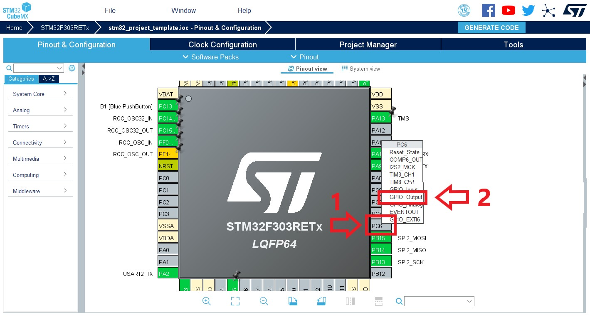

[](https://forthebadge.com)
[](https://forthebadge.com)

<!-- ALL-CONTRIBUTORS-BADGE:START - Do not remove or modify this section -->
[](#contributors-)
<!-- ALL-CONTRIBUTORS-BADGE:END -->


# 📡 STM32RF24

## 📜 Índice

- [🎉 Introdução](#-introdução)
- [➕ Requisitos](#-requisitos)
- [📦 Submódulos com Git](#-submódulos-com-git)
  - [💥 Adicionando um submódulo](#-adicionando-um-submódulo)
  - [✅ Inicializando um submódulo já existente](#-inicializando-um-submódulo-já-existente)
- [📁 Estrutura do Repositório](#-estrutura-do-repositório)
- [📝 Documentação](#-documentação)
- [🎨 Formatação](#-formatação)
- [🏗️ Estrutura do Código](#-estrutura-do-código)
- [🔌 Configuração de Hardware](#-configuração-de-hardware)
  - [🤔 Conhecendo o módulo](#-conhecendo-o-módulo)
  - [🔧 Configurando o microcontrolador](#-configurando-o-microcontrolador)
- [📚 Usando a biblioteca](#-usando-a-biblioteca)
  - [🏁 Inicializando](#-inicializando)
  - [📤 Utilizando como transmissor](#-utilizando-como-transmissor)
  - [📩 Utilizando como receptor](#-utilizando-como-receptor)
  - [🐛 Depuração](#-depuração)
- [👥 Contribuindo](#-contribuindo)
- [✨ Contribuidores](#-contribuidores)

## 🎉 Introdução

Esse repositório contém uma biblioteca para lidar com o módulo de radiofrequência nRF24L01 da Nordic Semiconductor, cujo datasheet pode ser visto [aqui](docs/Nordic_Semiconductor-NRF24L01-datasheet.pdf), ao se utilizar os microcontroladores da família [STM32](https://www.st.com/en/microcontrollers-microprocessors/stm32-32-bit-arm-cortex-mcus.html).

Essa biblioteca foi feita para ser utilizada como submódulo no [STM32ProjectTemplate](https://github.com/ThundeRatz/STM32ProjectTemplate).


## ➕ Requisitos

Essa biblioteca não requer, para funcionar, nenhum requisito extra, além dos já listados [requisitos do STM32ProjectTemplate](https://github.com/ThundeRatz/STM32ProjectTemplate#requisitos).

Porém, caso se deseje gerar a documentação, como descrito na seção [📝 Documentação](#-documentação), é necessário instalar o Doxygen. No Ubuntu é possível instalá-lo com o seguinte comando:

```bash
sudo apt install doxygen
```

Para outros sistemas operacionais é possível ver opções de download na [página oficial do Doxygen](https://www.doxygen.nl/download.html).

Além disso, para formatação é utilizado o `uncrustify`, como descrito na seção [🎨 Formatação](#-formatação). Para instalá-lo, no Ubuntu, rode o seguinte comando no terminal:

```bash
sudo apt install uncrustify
```

No Windows, baixe o .zip no [SourceForge](https://sourceforge.net/projects/uncrustify/files/). Adicione o local do executável na variável de ambiente `PATH`.


## 📦 Submódulos com Git

Como dito, essa biblioteca funciona como um submódulo. Dessa forma se facilita escolher a versão da biblioteca que será utilizada no projeto, permitindo também o desenvolvimento em paralelo dela.

### 💥 Adicionando um submódulo

Crie um diretório chamado `lib`, caso não exista:

```bash
mkdir lib
```

E adicione o submódulo fazendo:

* Com HTTPS:
```bash
git submodule add --name STM32RF24 https://github.com/ThundeRatz/STM32RF24.git lib/STM32RF24
```

* Com SSH:
```bash
git submodule add --name STM32RF24 git@github.com:ThundeRatz/STM32RF24.git lib/STM32RF24
```

### ✅ Inicializando um submódulo já existente

Ao clonar um repositório que já tenha submódulos, é necessário clonar os repositórios desse submódulo. Isso pode ser feito de duas formas, clonando junto com o repositório do projeto ou depois de já ter clonado.

Exemplo:

Para se clonar junto, rode o seguinte comando, trocando para o link do repositório do seu projeto:

```bash
git clone --recurse-submodules git@github.com:ThundeRatz/STM32ProjectTemplate.git
```

Para se clonar depois de já ter clonado o repositório do projeto, dentro dele, deve-se fazer:

```bash
git submodule update --init
```


## 📁 Estrutura do Repositório

O repositório contém as seguintes pastas:

- **docs/** → Arquivos de documentação
- **inc/** → Arquivos de cabeçalho
- **src/** → Arquivos de código fonte

Na raiz do repositório, além dos arquivos que contém o código de conduta, diretrizes de contribuição, README e licença, há o arquivo `sources.mk`, que é responsável por possibilitar com que os arquivos da biblioteca sejam encontrados quando se compila o código. Também há um `Doxyfile` para gerar a documentação. Outro arquivo relevante é o `uncrustify.cfg` que é utilizado para formatar os arquivos.


## 📝 Documentação

Essa biblioteca é documentada usando Doxygen. Para gera a documentação, rode o seguinte comando estando na raiz do seu repositório:

```bash
doxygen
```

As configurações estão no arquivo [Doxyfile](./Doxyfile).

## 🎨 Formatação

Além de uma boa documentação, é necessário que o código sempre esteja bem formatado, o que facilita sua compreensão. Para isso foi utilizado o `uncrustify`. Com o `uncrustify` instalado, para formatar um arquivo que tenha mudado, rode o seguinte comando:

```bash
uncrustify -c uncrustify.cfg --replace --no-backup caminho_até_o_arquivo/nome_do_arquivo
```

## 🏗️ Estrutura do Código

O código está estruturado da seguinte forma:

- `nrf24l01_registers.h` → tipos e constantes relacionados aos registradores do módulo.
- `rf24_platform.c/.h` → tipos e funções de mais baixo nível que utilizam o HAL.
- `rf24.c/.h` → tipos e funções de mais alto nível para utilização do usuário.
- `rf24_debug.c/.h` → funções úteis para se validar o funcionamento do módulo.


## 🔌 Configuração de Hardware

### 🤔 Conhecendo o módulo

Para se fazer a configuração do seu hardware, é necessário primeiramente se analisar a pinagem do módulo nRF24L01, como pode ser vista abaixo:


O módulo utiliza SPI (Serial Protocol Interface) para se comunicar com o microcontrolador (para saber mais sobre SPI, recomendo esse artigo [aqui](https://learn.sparkfun.com/tutorials/serial-peripheral-interface-spi/all) da Sparkfun), dessa forma são necessários quatro pinos para essa comunicação, o SCK, o MISO, o MOSI e o CSN. O CSN é um pino de GPIO, enquanto os outros são pinos dedicados.

Além disso, é necessário um pino de GPIO conectado ao CE (Chip Enable), que é utilizado para se fazer o controle do módulo, possibilitando a transição entre os estados da máquina de estados do módulo.

O módulo também conta com um pino IRQ (Interruption Request), possibilitando o funcionamento do módulo por meio de interrupções, esse pino deve ser conectado em um pino que suporte interrupções no microcontrolador caso se queira fazer uso desse recurso, caso contrário, deve-se ligá-lo ao 3,3V, uma vez que o pino é ativo baixo.

### 🔧 Configurando o microcontrolador

Para fazer a configuração do microcontrolador será utilizado o [STM32CubeMX](https://www.st.com/en/development-tools/stm32cubemx.html), um dos requisitos do [STM32ProjectTemplate](https://github.com/ThundeRatz/STM32ProjectTemplate). Além disso, será necessário já se ter um projeto configurado no Cube, caso não tenha veja o [README do STM32ProjectTemplate](https://github.com/ThundeRatz/STM32ProjectTemplate#stm32-project-template) e para mais detalhes veja o [STM32Guide](https://github.com/ThundeRatz/STM32Guide).

Com o projeto aberto, vá em _Connectivity_ e depois selecione um SPI disponível, como pode ser visto na imagem abaixo:


Ao fazer isso, se abrirá uma aba, onde se pode selecionar o modo do SPI, então selecione o modo _Full-Duplex Master_:


Com isso, como pode ser visto abaixo em "1", alguns pinos serão definidos automaticamente em algumas posições, porém é possível movê-los para outras caso estejam disponíveis. Para ver outras posições disponíveis, segure o botão _Ctrl_ e clique no pino que deseja mover, caso haja um outro pino que suporte a função do pino que deseja mover, a cor do alternativo irá se alterar.

Além disso, aparecerá um tela de configuração, na qual será necessário fazer algumas alterações. Como pode ser visto na página 45, item 8.1 do [datasheet](docs/Nordic_Semiconductor-NRF24L01-datasheet.pdf), o módulo trabalha com uma interface serial SPI de 4 cabos de 0Mbps a 8Mbps e comandos de 8 bits. Portanto, como pode ser visto abaixo em "2", deve-se definir o _Data Size_ como 8 bits e em "3" deve-se definir um valor de _Prescaler_ de forma a se obter um _Baud Rate_ de até 8Mbps.


Depois disso será necessário configurar o pino CSN, para isso, clique no pino que deseja utilizar para essa função e depois selecione a opção _GPIO_Output_, como pode ser visto na imagem abaixo (para esse tutorial o CSN ficará no pino PC6). Deve-se fazer o mesmo para o pino CE, uma vez que ele também é um _GPIO_Output_ (para esse tutorial o CSN ficará no pino PC8).



Por fim, para configurar o pino IRQ, clique no pino que deseja utilizar e selecione a opção _GPIO_EXTIx_, onde x depende do número do pino escolhido.  Abaixo foi utilizado o pino PC7 como exemplo, tendo-se assim que escolher o _GPIO_EXTI7_:


Como o pino IRQ é ativo baixo, é necessário configurá-lo assim. Para isso, como pode ser visto abaixo, vá em _System Core_ > _GPIO_, então na aba de configuração de GPIO selecione seu pino IRQ, com isso aparecerá uma lista de configurações do pino, na qual, em _GPIO Mode_ deve se escolher o modo _External Interrupt Mode with Falling edge trigger detection_.


Com todas as configurações feitas, salve o projeto e feche-o. Para gerar as arquivos do Cube, siga as instruções no [README do STM32ProjectTemplate](https://github.com/ThundeRatz/STM32ProjectTemplate#gerando-arquivos).

## 📚 Usando a biblioteca

A biblioteca possui diferentes funções para configurar parâmetros do módulo, receber e transmitir de formas diferentes. Nessa seção se mostrará uma forma básica de se inicializar o módulo, utilizá-lo como receptor ou como transmissor.

A comunicação entre dois módulos pode acontecer com _acknowledgment_ (ACK) ou sem. Utilizar ACK ajuda a evitar a perda de pacotes enviados. Ao se habilitar o ACK, o seu receptor, ao receber um pacote válido, enviará para o transmissor um pacote de ACK, caso contrário não enviará nada. Por sua vez, o transmissor, após enviar um pacote, ficará esperando receber um pacote de ACK por um determinado tempo, caso o tempo se esgote sem receber o ACK, ele enviará novamente o pacote que tinha enviado. Vários diagramas de transação diferentes podem ser vistos a partir da página 40, item 7.9 do [datasheet](docs/Nordic_Semiconductor-NRF24L01-datasheet.pdf). Nesse tutorial se mostrará como fazer a comunicação dos módulos com ACK, também se considerará que só há um transmissor e um receptor, porém é possível haver mais módulos.

Além do que será mostrado nas subseções abaixo, para o  funcionamento da biblioteca é necessário, em um dos seus arquivos `.c` que inclui o arquivo `rf24.h`, definir a seguinte função:

```C
/**
 * @brief Library delay function.
 *
 * @note This function must be implemented by the user.
 *
 * @param ms Delay in miliseconds.
 *
 * @return @ref rf24_status.
 */
rf24_status_t rf24_delay(uint32_t ms);
```

Ela é uma função de _delay_ utilizada dentro da biblioteca que recebe um tempo em milissegundos. Ela pode ser definida de formas distintas, porém, em geral, é possível defini-la simplesmente com a função `HAL_Delay(uint32_t Delay)` (é necessário incluir o arquivo `main.h` gerado pelo Cube para isso):

```C
rf24_status_t rf24_delay(uint32_t ms) {
    HAL_Delay(ms);

    return RF24_SUCCESS;
}
```

### 🏁 Inicializando

Antes de se inicializar o módulo em si, é necessário se inicializar o SPI que foi configurado no Cube. O nome da função depende de qual SPI se escolheu, para o escolhido na seção de [🔌 Configuração de Hardware](#-configuração-de-hardware) acima, seria a seguinte função:

```C
MX_SPI2_Init(); /* No Cube foi escolhido o SPI2 */
```

Para utilizar a função acima precisa-se incluir o arquivo `spi.h` gerado pelo Cube. Além disso, é recomendado se colocar um delay de algo em torno de 100 ms após a inicialização do SPI.

Depois, é necessário se definir no código quais foram os pinos e a instância do SPI escolhidos, além de outras configurações. Para isso irá se considerar os pinos escolhidos na seção de [🔌 Configuração de Hardware](#-configuração-de-hardware) e também que se mandará uma mensagem de 15 bytes, ou seja _payload size_ de 15.

Primeiramente se precisa criar uma instância de módulo e um ponteiro para ele:

```C
rf24_dev_t device; /* Instanciação de um módulo */
rf24_dev_t* p_dev = &device; /* Ponteiro para a instância do módulo */
```

Então para se configurar o módulo pode-se fazer da seguinte forma:

```C
/* Device config */

/* Obtém-se uma configuração padrão */
rf24_get_default_config(p_dev);

/* No Cube foi escolhido o SPI2 */
p_dev->platform_setup.hspi = &hspi2;

/* CSN no pino PC6 */
p_dev->platform_setup.csn_port = GPIOC;
p_dev->platform_setup.csn_pin = GPIO_PIN_6;

/* IRQ no pino PC7 */
p_dev->platform_setup.irq_port = GPIOC;
p_dev->platform_setup.irq_pin = GPIO_PIN_7;

/* CE no pino PC8 */
p_dev->platform_setup.ce_port = GPIOC;
p_dev->platform_setup.ce_pin = GPIO_PIN_8;

p_dev->payload_size = 15;
```

Por fim, é possível se inicializar o módulo, passando o ponteiro da instância do módulo para a seguinte função:

```C
rf24_init(p_dev);
```

Essa função irá retornar `RF24_SUCCESS` caso a inicialização seja bem sucedida e valores de erro caso contrário. Para mais detalhes sobre os possíveis valores de erro, veja a documentação do código.

### 📤 Utilizando como transmissor

Para se utilizar um módulo como transmissor é necessário saber o endereço do receptor para o qual se enviará a mensagem, essa informação precisa ser compartilhada entre os dois, caso contrário não é possível fazer a comunicação. Além disso, como aqui será mostrado como se comunicar com ACK, o transmissor se comportará por um período como receptor esperando o pacote de ACK, dessa forma também é necessário que ele tenha um endereço de receptor, esse endereço também precisa ser uma informação que os dois módulos têm.

Para tanto o exemplo de transmissor quanto o de receptor será usado o vetor de endereços abaixo, onde o primeiro é o endereço para o transmissor receber o pacote de ACK e o segundo o endereço do receptor, para onde o transmissor irá enviar. Os tamanhos dos endereços são configuráveis, porém se utilizará endereços de 5 bytes.

```C
uint8_t addresses[2][5] = {{0xE7, 0xE7, 0xE7, 0xE7, 0xE8}, {0xC2, 0xC2, 0xC2, 0xC2, 0xC1}};
```

Para a parte de configuração do transmissor também é interessante se escolher uma potência de saída do módulo com a seguinte função:

```C
/**
 * @brief Set device output power.
 *
 * @param p_dev         Pointer to rf24 device.
 * @param output_power  Selected output power.
 *
 * @return @ref rf24_status.
 */
rf24_status_t rf24_set_output_power(rf24_dev_t* p_dev, rf24_output_power_t output_power);
```

Agora, para se receber e enviar de acordo com os endereços certos, é necessário se abrir um _pipe_ de escrita para o endereço `addresses[1]` e um de leitura para o `addresses[0]`, o que pode ser feito da seguinte forma:

```C
rf24_status_t device_status; /* Variável para receber os status retornados pelas funções */

device_status = rf24_open_writing_pipe(p_dev, addresses[1]);
device_status = rf24_open_reading_pipe(p_dev, 1, addresses[0]);
```

Com isso feito, já é possível se enviar mensagens! Digamos que se deseje enviar a seguinte mensagem armazenada em um vetor:

```C
uint8_t buffer[] = {'V', 'i', 'r', 't', 'u', 'a', 'l', ' ', 'h', 'u', 'g', 's', '!', '\r', '\n'};
```

Para mandá-la com ACK, pode-se fazer da seguinte forma:

```C
device_status = rf24_write(p_dev, buffer, 15, true);
```

Essa função retornará `RF24_SUCCESS` caso o transmissor tenha conseguido enviar a mensagem e, como a comunicação é feita com ACK, caso o receptor tenha recebido a mensagem.

### 📩 Utilizando como receptor

Assim como foi falado na [subseção do transmissor](#-utilizando-como-transmissor), o endereço para o qual o transmissor enviará os dados precisa ser o mesmo que está registrado no código do receptor, assim como o endereço para o qual o receptor enviará o pacote de ACK precisa ser o mesmo que está no transmissor, por isso, serão usados os mesmos endereços do tutorial do transmissor:

```C
uint8_t addresses[2][5] = {{0xE7, 0xE7, 0xE7, 0xE7, 0xE8}, {0xC2, 0xC2, 0xC2, 0xC2, 0xC1}};
```

No caso do receptor, para se receber e enviar de acordo com os endereços certos, é necessário se abrir um _pipe_ de escrita para o endereço `addresses[0]` e um de leitura para o `addresses[1]`, como é feito abaixo:

```C
rf24_status_t device_status; /* Variável para receber os status retornados pelas funções */

device_status = rf24_open_writing_pipe(p_dev, addresses[0]);
device_status = rf24_open_reading_pipe(p_dev, 1, addresses[1]);
```

Além disso, para que o receptor possa começar a receber pacotes, é necessário chamar a seguinte função:

```C
device_status = rf24_start_listening(p_dev);
```

Com isso, já é possível receber pacotes! É possível verificar se há um pacote novo com a seguinte função:

```C
/**
 * @brief Checks if a new payload has arrived.
 *
 * @param p_dev         Pointer to rf24 device.
 * @param pipe_number   Pipe where the available data is.
 *
 * @note To don't ready a pipe, pass NULL as pipe_number argument.
 *
 * @return @ref rf24_status.
 */
rf24_status_t rf24_available(rf24_dev_t* p_dev, uint8_t* pipe_number);
```

E é possível ler pacotes com a seguinte função:

```C
/**
 * @brief Reads the payload avaible in the receiver FIFO.
 *
 * @note Interruption flags related to the receiver are cleared.
 *
 * @param p_dev Pointer to rf24 device.
 * @param buff Pointer to a buffer where the data should be written
 * @param len Maximum number of bytes to read into the buffer
 *
 * @return @ref rf24_status.
 */
rf24_status_t rf24_read(rf24_dev_t* p_dev, uint8_t* buff, uint8_t len);
```

Portanto, para se verificar se há pacotes na fila e ler o último pacote, pode-se fazer da seguinte forma:

```C
rf24_status_t device_status;
rf24_status_t read_status;

uint8_t buffer[15] = {0};

if ((device_status = rf24_available(p_dev, NULL)) == RF24_SUCCESS) {
    while ((device_status = rf24_available(p_dev, NULL)) == RF24_SUCCESS) {
        read_status = rf24_read(p_dev, buffer, p_dev->payload_size);
    }

    /* Faça alguma coisa com o pacote lido */
}
```

### 🐛 Depuração

Para depurar o seu código é possível utilizar as funções do `rf24_debug.c/.h`, porém para isso também é necessário definir uma função `printf`. Para facilitar o uso, recomendo adicionar a biblioteca [SEGGER_RTT](https://github.com/ThundeRatz/SEGGER_RTT) ao projeto. Após adicioná-la, tendo chamado as funções de depuração em seu código, para ver o que está sendo "impresso" pelas funções, rode no terminal, estando na raiz de seu projeto:

```C
make rtt
```

## 👥 Contribuindo

Toda a ajuda no desenvolvimento da robótica é bem-vinda, nós lhe encorajamos a contribuir para o projeto! Para saber como fazer, veja as diretrizes de contribuição [aqui](CONTRIBUTING.pt-br.md).

## ✨ Contribuidores

Agradecimento a essas pessoas maravilhosas ([emoji key](https://allcontributors.org/docs/en/emoji-key)):

<!-- ALL-CONTRIBUTORS-LIST:START - Do not remove or modify this section -->
<!-- prettier-ignore-start -->
<!-- markdownlint-disable -->
<table>
  <tr>
    <td align="center"><a href="https://github.com/LucasHaug"><br /><sub><b>Lucas Haug</b></sub></a><br /><a href="https://github.com/ThundeRatz/STM32RF24/commits?author=LucasHaug" title="Code">💻</a> <a href="https://github.com/ThundeRatz/STM32RF24/commits?author=LucasHaug" title="Documentation">📖</a> <a href="https://github.com/ThundeRatz/STM32RF24/commits?author=LucasHaug" title="Tests">⚠️</a> <a href="#translation-LucasHaug" title="Translation">🌍</a></td>
    <td align="center"><a href="https://github.com/lucastrschneider"><br /><sub><b>Lucas Schneider</b></sub></a><br /><a href="https://github.com/ThundeRatz/STM32RF24/commits?author=lucastrschneider" title="Code">💻</a> <a href="https://github.com/ThundeRatz/STM32RF24/commits?author=lucastrschneider" title="Documentation">📖</a> <a href="https://github.com/ThundeRatz/STM32RF24/commits?author=lucastrschneider" title="Tests">⚠️</a> <a href="#translation-lucastrschneider" title="Translation">🌍</a></td>
    <td align="center"><a href="https://github.com/d-nery"><br /><sub><b>Daniel Nery</b></sub></a><br /><a href="https://github.com/ThundeRatz/STM32RF24/commits?author=d-nery" title="Code">💻</a></td>
    <td align="center"><a href="https://github.com/FelipeGdM"><br /><sub><b>Felipe Gomes de Melo</b></sub></a><br /><a href="#ideas-FelipeGdM" title="Ideas, Planning, & Feedback">🤔</a></td>
    <td align="center"><a href="https://github.com/Berbardo"><br /><sub><b>Bernardo Coutinho</b></sub></a><br /><a href="https://github.com/ThundeRatz/STM32RF24/commits?author=Berbardo" title="Tests">⚠️</a></td>
  </tr>
</table>

<!-- markdownlint-restore -->
<!-- prettier-ignore-end -->

<!-- ALL-CONTRIBUTORS-LIST:END -->

Esse projeto segue as especificações do [all-contributors](https://github.com/all-contributors/all-contributors). Contribuições de qualquer tipo são bem-vindas!

---------------------


